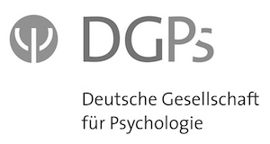
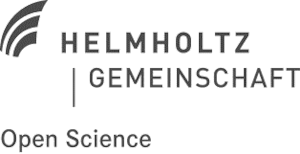
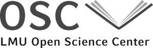
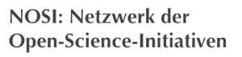

+++
title = "German Reproducibility Network"
description = "Working together for trustworthy and useful research"
template = "landing.html"
+++

## Mission

The German Reproducibility Network (GRN) is a cross-disciplinary consortium that aims at increasing trustworthiness and transparency of scientific research by investigating and encouraging the factors that contribute to robust research. We promote training activities and disseminate best practices, conduct and support meta-scientific research, and work with stakeholders to ensure coordination of efforts. GRN’s activities span multiple levels, including researchers, institutions and other stakeholders (e.g., funders, publishers, and Academic Societies).

----

## Founding members

Contact: [Prof. Dr. Christian Fiebach](https://www.dgps.de/index.php?id=christianfiebach)

Contact: [Dr. Bernadette Fritzsch](https://os.helmholtz.de/open-science-in-der-helmholtz-gemeinschaft/akteure-und-ihre-rollen/)

Contact: [Prof. Dr. Klaus Tochtermann](http://www.zbw.eu/de/forschung/klaus-tochtermann/)

Contact: [PD Dr. Felix Schönbrodt](https://www.osc.uni-muenchen.de/members/individual-members/schoenbrodt/index.html)

Contact: [Dr. Susann Fiedler](https://www.coll.mpg.de/susann-fiedler)
      and  [Dr. Rima-Maria Rahal](https://www.coll.mpg.de/135848/dr-rima-maria-rahal)

Contact: [Prof. Dr. Ulrich Dirnagl](https://www.bihealth.org/de/forschung/quest-center/team/quest-office/)

----

## International partners

[UK Reproducibility Network] (https://www.ukrn.org/)
[Swiss Reproducibility Network] (https://www.swissrn.org/)
[Australian Reproducibility Network] (http://aus-rn.org/)
[Slovak Reproducibility Network] (webpage coming soon)
---

Contact us: [info@reproducibilitynetwork.de](mailto:info@reproducibilitynetwork.de)

TODO: Unnötige Menüpunkte raus
TODO: Bei UK und SWiss schauen und kopieren.
