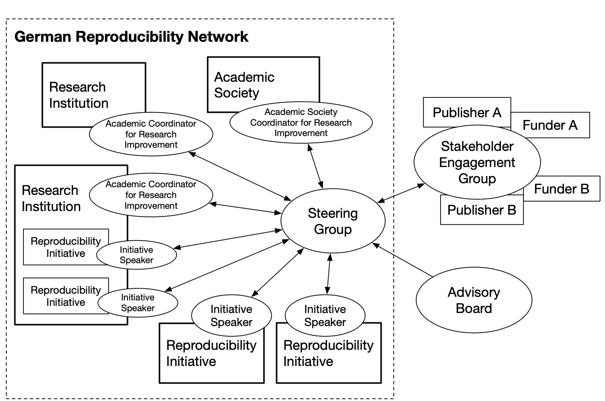

+++
title = "Terms of Reference: Organization and Membersup"
+++

Organization and Membership
---------------------------

GRN consists of a *Steering Group* ("Steuerungsgruppe"),
*Reproducibility Initiatives* (represented by an Initiative Speaker
("Sprecher/in der Initiative")), *Research Institutions* (represented by
an *Academic Coordinator for Research Improvement* ("Wissenschaftliche/r
Koordinator/in für Forschungsqualität")) and *Academic Societies*
("Wissenschaftliche Fachgesellschaften"). The *Steering Group* is
advised by an external Advisory Board comprising senior academics from
the international research community.

Stakeholders ("forschungsbezogene Interessengruppen", im Folgenden
"Stakeholder"), e.g., funders and publishers, who support the GRN
(either directly or via access to resources and other forms of support
in kind) form the *Stakeholder Engagement Group*
("Stakeholder-Dialoggruppe"). This ensures that GRN activity is aligned
with the strategy and activity of the stakeholders, and allows the
exchange of ideas. In addition, the relationship between the
*Stakeholder Engagement Group* and the GRN provides stakeholders with a
mechanism for obtaining feedback from the research community on new
initiatives. Stakeholders may be full or affiliate members -- membership
conditions are described in more detail at Annex 2.

  

<small class="text-muted d-block mb-5">
Note: We provide a list of roles within the GRN, their representatives
and their German translations in Annex 7.
</small>

GRN has four types of membership:

1. *Steering Group* (comprised of Steering Group Members, coordinates GRN activities, provides organizational structures and engages in the strategic development of GRN)
2. *Reproducibility Initiatives* (represented each by an *Initiative Speaker*, implement GRN activities in their individual networks)
3. *Research Institutions* (represented each by an *Academic Coordinator for Research Improvement*, institutionally implement GRN goals)
4. *Academic Societies* (represented each by a *Academic Society Coordinator for Research Improvement*, promote GRN goals on the level of academic societies)

----

1. The *Steering Group* is responsible for the overall coordination of GRN activity and strategy. It should comprise around 8-12 members and it is planned to add support through a part-time administrator. The *Steering Group* reports to the Speakers of the GRN's de-central *Reproducibility Initiatives* and the *Academic Coordinators* of the GRN's member *Research Institutions*, and to the *Stakeholder Engagement Group*, by means of an annual meeting (to be held in March). As soon as administrative support is assured, GRN will furthermore publish an annual report of its activities. The founding committee, consisting of Felix Schönbrodt, Ulrich Dirnagl, Rima-Maria Rahal, Bernadette Fritzsch, Klaus Tochtermann, Jutta Graf, Susann Fiedler and Christian Fiebach, acts as interim Steering Group until May 2022; In May 2021 the *Steering Group* will appoint new members.

2. *Reproducibility Initiatives* are locally or non-locally organized networks of researchers that can form in a bottom-up manner at one or more institutions. The suggested name for a *Reproducibility Initiative* member of GRN is "German Reproducibility Network: XXX" (e.g., GRN:Berlin, GRN:Munich, or GRN:Neuroscience). The establishment of Reproducibility Initiatives is independent of whether or not the respective institution(s) are institutional members of GRN. A *Reproducibility Initiative Speaker* represents the respective *Reproducibility Initiative* and serves as the point of contact for GRN. *Reproducibility Initiatives* promote the aims of the GRN within individual institutions, fields, or regarding specific focus topics. This can be achieved by establishing open research working groups, running training workshops, advocating for the wider adoption of best practice within the institution, fostering meta-research, etc. In addition, *Reproducibility Initiatives* allow for peer support from their members on matters related to the aims of GRN. It is intended that these *Reproducibility Initiatives* will grow, both in number and size, over time, as researchers elect to participate in GRN activity. *Reproducibility Initiatives* are self-organising, but we encourage them to ensure their membership is open to academic and research staff (at all levels) and professional services staff. The number of local networks per institution is in principle not limited, but researchers are encouraged to organize local activities through one local network per institution.

3. *Research Institutions* can join the GRN by formally committing to supporting the aims of the Network, creating a formal role within the senior management team (an *Academic Coordinator for Research Improvement*), and supporting the delivery of GRN activities (training, workshops etc.) within the institution (e.g., via undergraduate, postgraduate, postdoctoral and senior training programmes, by establishing institutional research transparency policies, etc.). The *Academic Coordinator* is independent of the *Reproducibility Initiative Speaker*, and is the institutional point of contact for GRN, representing that institution's senior management team. At the same time, the GRN encourages and supports close collaboration and exchange between *Reproducibility Initiative Speaker* and *Academic Coordinator* within an institution. Logos of participating Research Institutions are displayed on the GRN website.

4. *Academic Societies* can become members of the GRN by formally committing to the aims of the Network. They serve a complementary role to institutional members by disseminating and supporting the goals and activities of the GRN in the researcher communities of the different scientific disciplines. The steering committee of the respective *Academic Society* appoints an *Academic Society Coordinator for Research Improvement* who acts as a point of contact for the GRN. Logos of *Academic Society* members will be displayed on the GRN website.

The criteria for joining GRN are provided in Annex 2, model role
descriptions of the *Academic Coordinator for Research Improvement* at
Annex 3, the *Reproducibility Initiative Speaker* at Annex 4 and the
*Academic Society Coordinator for Research Improvement* at Annex 5.

### Accountability

The *Steering Group* operates based on mutual influence with
*Reproducibility Initiative Speakers* and the *Stakeholder Engagement
Group* and is advised by the Advisory Board.. Individual members of the
*Reproducibility Initiatives* report to their *Reproducibility
Initiative Speakers*, and *Reproducibility Initiatives* are responsible
for their internal governance (which may vary depending on the size of
the *Reproducibility Initiative*, distribution of the institution(s),
etc.). The *Steering Group* and the *Reproducibility Initiative
Speakers* operate with the consent of the individual members.

*Academic Coordinators* are independent of *Reproducibility
Initiatives*, but are expected to work in partnership at an
institutional level, to ensure coordination of activity and that any
*Reproducibility Initiatives* are developed with the input of
*Reproducibility Initiative Speakers* and members. *Academic
Coordinators* liaise with the *Steering Group* informally.

The Steering Group meets with the individual *Academic Coordinators,*
*Reproducibility Initiative Speakers*, *Academic Society* *Coordinator
for Research Improvement* and Advisory Board annually to review
progress, agree on strategy and direction, and formulate objectives for
the forthcoming year. Following this meeting, the *Steering Group* and
Advisory Board meet with the *Stakeholder Engagement Group* to review
the strategy and annual plan and identify specific projects where the
GRN and individual stakeholders may work together.

### Review

Members of the Advisory Board are asked to serve a three-year term in
the first instance, with the option to renew this for a further three
years at the end of this term. The *Steering Group*, with the input of
the Advisory Board, reviews the governance structures of GRN annually.

### Ways of working

GRN coordinates activity across *Reproducibility Initiatives* in three
broad areas: 1) meta-research (including evaluation of innovations
intended to improve research quality); 2) promoting training (e.g.,
delivery of short courses to early career researchers, preparation of
online materials, coordination of virtual seminars and journals clubs);
and 3) engagement with relevant stakeholders (e.g., funders, publishers,
academic societies, policymakers, etc.) to align and coordinate strategy
and activity.

GRN follows a distributed model, where *Reproducibility Initiatives* can
be supported by individuals acting as advocates for the work of the GRN,
or formally by their institution following a commitment of support for
the aims of GRN by that institution (as described in Annex 2).\
*Reproducibility Initiatives* promote the aims of the GRN in geographic
areas, within individual institutions, fields, or regarding specific
focus topics. This can be achieved by establishing open research working
groups, running training workshops, advocating for the wider adoption of
best practice within the institution, fostering meta-research, etc. In
addition, *Reproducibility Initiatives* allow for peer support from
their members on matters related to the aims of GRN.

*Reproducibility Initiatives* are self-organising, but are encouraged to
ensure that membership in their typically informal groups is open to
academic and research staff (at all levels) and professional services
staff with connection to research.

*Reproducibility Initiatives* implement GRN activities coordinated
through the *Steering Group* and arising from demand in their network,
and link with relevant institutions and stakeholders in implementing
these activities. *Reproducibility Initiatives* can influence the
strategy and aims of the GRN by communicating with the *Steering Group*,
for example in the annual meeting.

GRN is planned to be supported by financial and in-kind contributions
from stakeholders and institutions. Financial support for GRN is listed
on the GRN website for transparency. The GRN itself is not acting as a
funder of (meta-) research. Such activities shall be supported
separately by grant funding, philanthropic donations and institutional
support.

Information about the Network is presented on the GRN website at
http://www.reproducibilitynetwork.de, which will include a list of
supporters (stakeholders and institutions), as well as *Reproducibility
Initiative Speakers* and their institution, *Academic Coordinators* and
their institution, and *Academic Society* members. It will also provide
links to resources (e.g., training materials), information about joining
the GRN (either as a *Reproducibility Initiative*, an institution, or a
*Academic Society*) or supporting GRN (as a stakeholder), and links to
relevant external resources.

Working groups are formed as required to coordinate on individual
initiatives. GRN also, subject to funding, holds a Germany-based
conference, to bring together researchers from Germany and beyond
engaged in meta-research questions. Any income from the conference or
GRN workshops is used to support the work of the network, with a view to
eventually place the GRN on a sustainable financial footing.

While the focus of GRN is on improving research in Germany, an important
role is to work with those in other countries who share our objectives
of improving research.

### Meetings

The *Steering Group* meets at least once every quarter via
teleconference to discuss GRN activities and development, new and
emerging evidence, training etc. of relevance to GRN, feedback from
Reproducibility Initiatives, and input from stakeholders. *Academic
Societies* and *Research Institutions.* In these meetings of the
*Steering Group*, decisions can be reached by a simple majority if at
least half of the members of the *Steering Group* are present.

The *Steering Group* also plans to meet every year with the Advisory
Board. This forms part of a larger meeting to which the *Reproducibility
Initiative Speakers*, Research Institutions' *Academic Coordinators*,
*the Academic Society Coordinators* and the *Stakeholder Engagement
Group* are invited. The focus of this annual meeting is to discuss the
work of GRN and coordinate future activity, both within the GRN, and
between the GRN and the individual stakeholders.

Meetings are not formally minuted, but the *Steering Group* Chair
reports back to the *Reproducibility Initiative Speakers* on key points
arising from meetings with the *Advisory Board, stakeholders*, *Research
Institutions*, etc.

### Sharing of information

The primary means of communication between the *Steering Group* and
*Reproducibility Initiative Speakers, Academic Coordinators*, *Academic
Society Coordinators*, and Stakeholders is digital, supplemented by the
schedule of meetings described above. The primary means of communication
between *Reproducibility Initiative Speakers* and members of
*Reproducibility Initiatives* is decided on the local level, but
presumably varies depending on the size of the *Reproducibility
Initiative*, geographical distribution of the institution, etc
